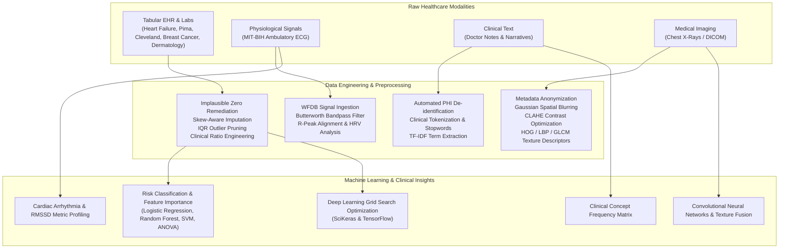

# AI in Healthcare — Clinical & Multimodal Machine Learning Pipelines

[](LICENSE)
[](https://www.python.org/downloads/)
[](https://jupyter.org/)
[](#-multimodal-architecture)

An end-to-end, production-oriented repository of **Healthcare Artificial Intelligence and Data Engineering Pipelines**. This repository demonstrates rigorous data acquisition, cleaning, preprocessing, feature engineering, baseline machine learning, and deep learning workflows across four foundational medical modalities:

- 📊 **Structured Clinical Records** (Tabular lab metrics, vitals, electronic health records)
- 🫀 **Physiological Time-Series Signals** (Ambulatory ECG, WFDB annotations, Heart Rate Variability)
- 📝 **Unstructured Clinical Text** (Medical narratives, PHI de-identification, TF-IDF vectorization)
- 🩻 **Medical Imaging** (Chest X-rays, DICOM handling, spatial noise filtering, CLAHE contrast enhancement)

---

## 🏗 Multimodal Architecture



---

## 📁 Repository Structure

```
AI_in_healthcare/
├── 01-clinical-data-cleaning-heart-failure/
│   ├── clinical_data_cleaning_heart_failure.ipynb   # Tabular clinical data cleaning pipeline
│   ├── README.md                                    # Detailed project documentation
│   ├── requirements.txt                             # Pipeline-specific dependencies
│   └── LICENSE                                      # MIT License
│
├── 02-multimodal-health-data-pipeline/
│   ├── multimodal_health_pipeline.ipynb             # Multimodal ingestion & baseline modeling
│   ├── README.md                                    # Detailed project documentation
│   ├── requirements.txt                             # Pipeline-specific dependencies
│   └── LICENSE                                      # MIT License
│
├── 03-multimodal-medical-data-acquisition-preprocessing/
│   ├── multimodal_medical_data_acquisition_cleaning_preprocessing.ipynb # In-depth 4-modality pipeline
│   ├── README.md                                    # Detailed project documentation
│   ├── requirements.txt                             # Pipeline-specific dependencies
│   └── LICENSE                                      # MIT License
│
├── labs/                                            # CSET343 AI in Healthcare Coursework Labs
│   ├── lab4_logistic_regression_breast_cancer.py    # Binary classification on breast cancer
│   ├── lab5_multiclass_dermatology.py               # Multiclass classification on dermatology
│   ├── lab6_chest_xray_cnn.py                       # Hybrid CNN + HOG/LBP/GLCM on chest X-rays
│   ├── lab7_grid_search_pima.py                     # Keras DL hyperparameter grid search
│   ├── README.md                                    # Comprehensive lab documentation & guides
│   └── requirements.txt                             # Lab dependencies
│
├── .gitignore                                       # Python, Jupyter, outputs, and OS exclusions
├── LICENSE                                          # Repository MIT License
├── README.md                                        # Master repository documentation
└── requirements.txt                                 # Unified environment dependencies
```

---

## 🔬 Project Modules & Labs Overview

### [Module 1: Clinical Data Cleaning & Enrichment — Heart Failure](01-clinical-data-cleaning-heart-failure/)
[](https://colab.research.google.com/github/Cosmicgod5151/AI_in_healthcare/blob/main/01-clinical-data-cleaning-heart-failure/clinical_data_cleaning_heart_failure.ipynb)

- **Focus**: Tabular clinical data quality and engineering on the UCI Heart Failure Clinical Records dataset (299 patients, 13 clinical features).
- **Techniques**:
  - Controlled Missing Completely at Random (MCAR) simulation and missingness heatmaps.
  - Skew-aware imputation (median for skewed biomarkers like `serum_creatinine`, mode for categoricals).
  - Interquartile Range (IQR) outlier pruning without physiological distortion.
  - Logical inconsistency validation (physiological bounds for sodium, age, ejection fraction).
  - Clinical feature engineering: Creatinine-Sodium ratio and Age-Risk stratifications.
  - Comparative pre-vs-post statistical validation and distribution shifts.

---

### [Module 2: Multimodal Healthcare Data Pipeline](02-multimodal-health-data-pipeline/)
[](https://colab.research.google.com/github/Cosmicgod5151/AI_in_healthcare/blob/main/02-multimodal-health-data-pipeline/multimodal_health_pipeline.ipynb)

- **Focus**: Modular ingestion and baseline modeling across tabular, physiological signal, text, and imaging modalities.
- **Techniques**:
  - Per-modality modular loaders with schema validation.
  - Built-in synthetic fallback generators enabling offline execution.
  - Baseline Logistic Regression risk classification on the 14-feature UCI Cleveland Heart Disease dataset with ROC-AUC evaluation.
  - PhysioNet WFDB format ingestion (`.dat`/`.hea`/`.atr`), R-peak alignment, and Heart Rate Variability (RR-intervals) computation.
  - Clinical text tokenization, stopword removal, and frequency modeling.
  - Medical image resizing ($224 \times 224$), channel normalization, and pixel distribution analysis.

---

### [Module 3: Multimodal Medical Data Acquisition & Preprocessing](03-multimodal-medical-data-acquisition-preprocessing/)
[](https://colab.research.google.com/github/Cosmicgod5151/AI_in_healthcare/blob/main/03-multimodal-medical-data-acquisition-preprocessing/multimodal_medical_data_acquisition_cleaning_preprocessing.ipynb)

- **Focus**: Advanced clinical preprocessing and statistical modeling across all 4 modalities.
- **Techniques**:
  - **Tabular**: Detection of implicit missingness (medically impossible zero values in Blood Pressure, Glucose, BMI), class-stratified median imputation (diabetic vs. non-diabetic), ANOVA F-rankings, Chi-Square tests, and Random Forest feature importance.
  - **Clinical NLP**: Automated regex-based Protected Health Information (PHI) de-identification, token cleaning, and TF-IDF matrix generation.
  - **Medical Imaging**: DICOM metadata scrubbing, Contrast Limited Adaptive Histogram Equalization (CLAHE), and Gaussian spatial noise filtering.
  - **Physiological Signals**: 4th-order Butterworth bandpass filtering ($0.5-40\text{ Hz}$) to eliminate baseline wander and powerline noise, cardiac cycle segmentation, and RMSSD / LF-HF ratio extraction.

---

### [Coursework Labs: CSET343 AI in Healthcare](labs/)

- **Focus**: Practical implementations of clinical diagnostic classifiers, deep learning architectures, and computer vision feature extractors.
- **Labs**:
  - **Lab 4**: Binary Logistic Regression classification on the Wisconsin Diagnostic Breast Cancer dataset (evaluating ROC-AUC and threshold optimization).
  - **Lab 5**: Multiclass benchmark (Logistic Regression, k-NN, Random Forest, SVM, Decision Tree) on the 6-class UCI Dermatology dataset.
  - **Lab 6**: Hybrid CNN and handcrafted computer vision feature fusion (HOG, LBP, GLCM) for pediatric Chest X-Ray pneumonia detection.
  - **Lab 7**: Deep neural network architecture grid search tuning using SciKeras & TensorFlow on the Pima Indians Diabetes dataset.

---

## 🛠 Tech Stack

| Category | Libraries & Tools |
| :--- | :--- |
| **Core & Analysis** | `pandas`, `numpy`, `scipy` |
| **Machine Learning & Stats** | `scikit-learn` |
| **Deep Learning & Neural Networks** | `tensorflow`, `scikeras` |
| **Biomedical Signals** | `wfdb` (PhysioNet Waveform Database) |
| **Computer Vision & Medical Imaging** | `opencv-python`, `Pillow` (PIL), `scikit-image` |
| **Clinical NLP** | `nltk` |
| **Visualization** | `matplotlib`, `seaborn` |
| **Interactive Environments** | `JupyterLab`, `Jupyter Notebook`, `Google Colab` |

---

## 🚀 Quickstart Guide

### 1. Prerequisites
- Python 3.10 or higher
- Git

### 2. Clone the Repository
```bash
git clone https://github.com/Cosmicgod5151/AI_in_healthcare.git
cd AI_in_healthcare
```

### 3. Create & Activate Virtual Environment
```bash
# Windows
python -m venv venv
.\venv\Scripts\activate

# Linux / macOS
python3 -m venv venv
source venv/bin/activate
```

### 4. Install Dependencies
To install all requirements across all pipelines and labs:
```bash
pip install -r requirements.txt
```

Alternatively, install dependencies for an individual subfolder:
```bash
cd labs
pip install -r requirements.txt
```

### 5. Launch Interactive Notebooks or Run Lab Scripts
- **Launch Jupyter Notebooks**:
  ```bash
  jupyter notebook
  ```
- **Execute a Lab Assignment**:
  ```bash
  python labs/lab4_logistic_regression_breast_cancer.py
  python labs/lab5_multiclass_dermatology.py
  python labs/lab6_chest_xray_cnn.py
  python labs/lab7_grid_search_pima.py
  ```

---

## 📊 Datasets & Attribution

1. **Heart Failure Clinical Records**: [UCI ML Repository](https://archive.ics.uci.edu/ml/datasets/Heart+failure+clinical+records) (*Chicco & Jurman, 2020*).
2. **Cleveland Heart Disease Dataset**: [UCI ML Repository](https://archive.ics.uci.edu/ml/datasets/heart+disease) (*Janosi, Steinbrunn, Pfisterer, Detrano*).
3. **Pima Indians Diabetes Dataset**: National Institute of Diabetes and Digestive and Kidney Diseases (*Smith et al., 1988*).
4. **MIT-BIH Arrhythmia Database**: [PhysioNet](https://physionet.org/content/mitdb/1.0.0/) (*Moody & Mark, 2001*).
5. **Wisconsin Diagnostic Breast Cancer**: [UCI ML Repository / Scikit-Learn](https://scikit-learn.org/stable/modules/generated/sklearn.datasets.load_breast_cancer.html) (*Street, Wolberg, Mangasarian*).
6. **Dermatology Dataset**: [UCI ML Repository](https://archive.ics.uci.edu/ml/datasets/dermatology) (*Guvenir et al.*).
7. **Chest X-Ray Images (Pneumonia)**: [Kaggle](https://www.kaggle.com/datasets/paultimothymooney/chest-xray-pneumonia) (*Paul Mooney, Kermany et al.*).

---

## 📜 License

This project is licensed under the **MIT License** — see the [LICENSE](LICENSE) file for details.
